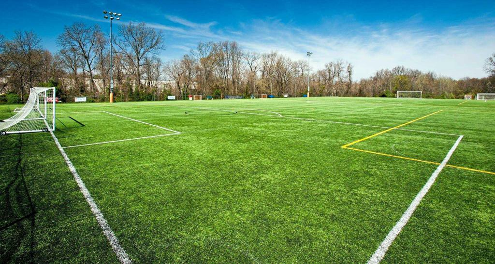

<!DOCTYPE html>
<html>
<head>
<meta name="viewport" content="width=device-width, initial-scale=1">
</head>
<body>
    

 <button class="tablink" onclick="openPage('Home', this, 'black')" id="defaultOpen">Home</button>
 <button class="tablink" onclick="openPage('Portfolio', this, 'black')">Portfolio</button>
 <button class="tablink" onclick="openPage('AboutMe', this, 'black')">About Me</button>

 

  <h1>This is Alan Coronado's Home Page!!!</h1>
  <h2>This is my home away from home:</h2>
  
 

 

  <h1>Below you can see some of my Assigments:</h1>
  
 
 

 

  <h1>Here is a little background information about myself: </h1>
  
  
"This is where I am from"

 

   
</body>
</html> 
